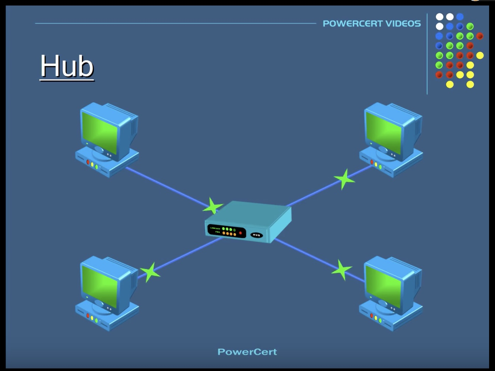
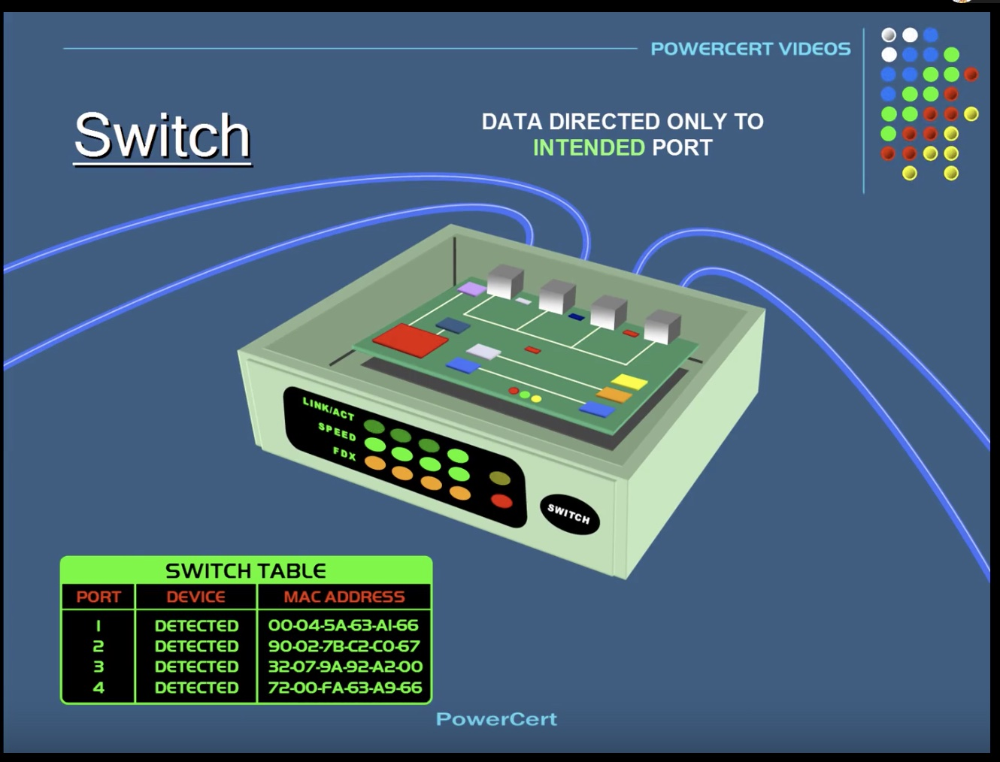
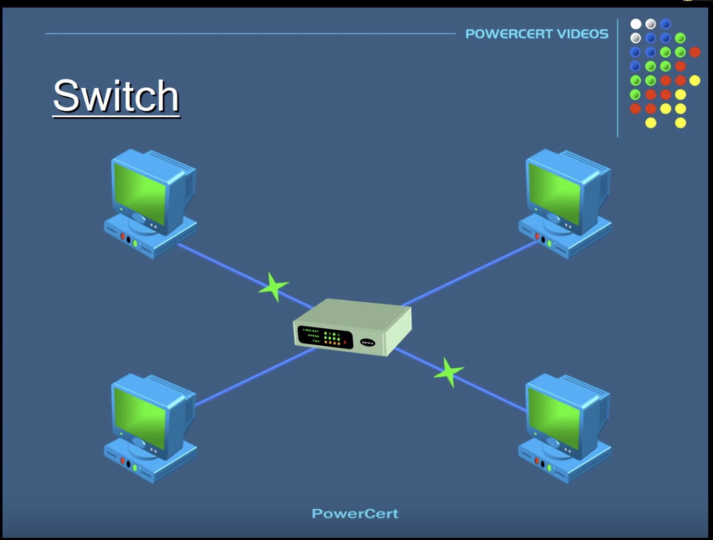
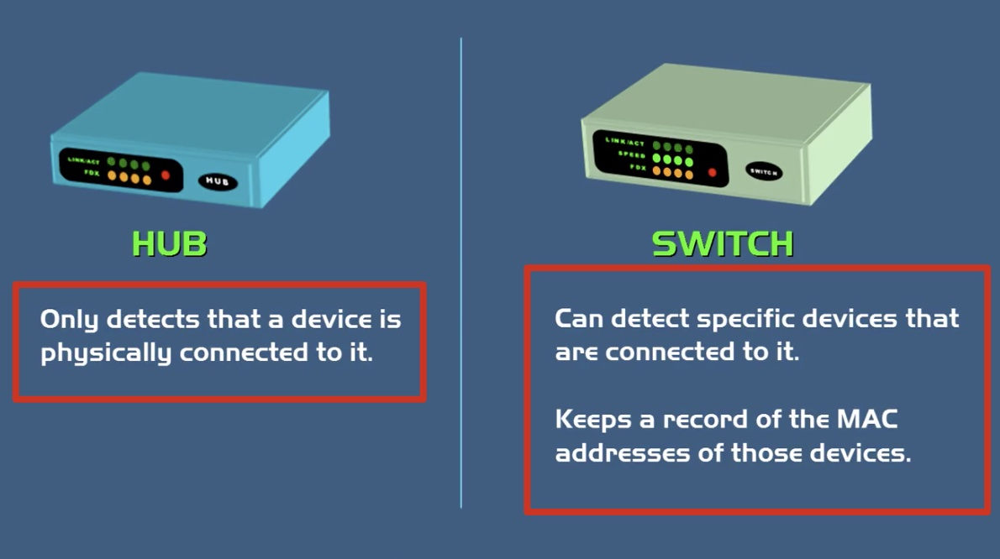
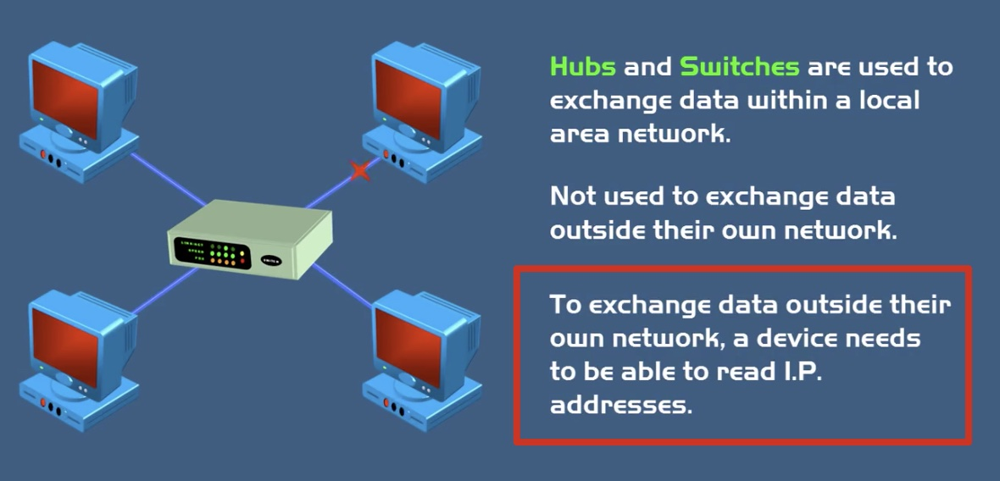
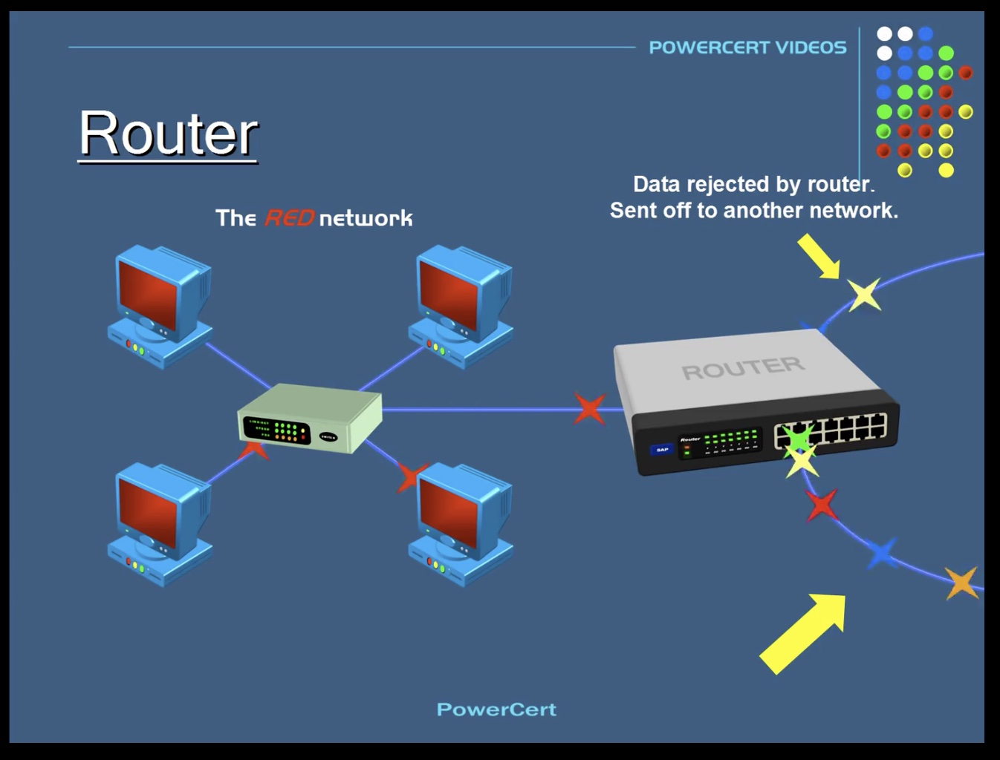
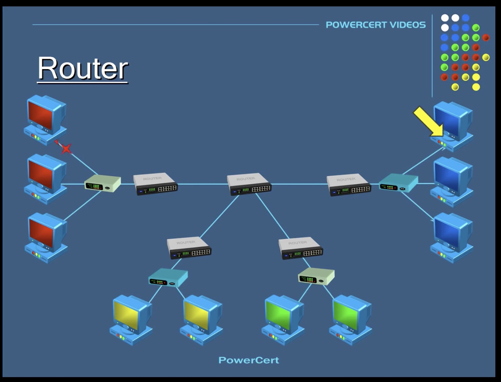
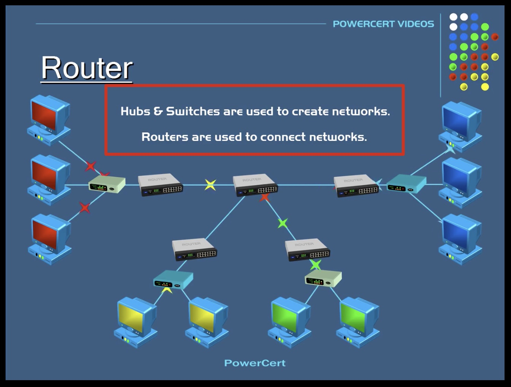

## hub/switch/router的区别

- Hub 集线器

> 单集线的作用是把内网中的网络设备连接起来，它不会过滤数据，也没有关于数据应该发向哪里的智能。当一个端口收到数据之后，它会将数据广播到所有的连接设备上。
>
> 

- Switch 交换机

> Switch 能够解析连接在端口的设备的物理地址(MAC地址)，并把这些地址存到一张表中记录，所以当一个数据包发送到一个交换机，它只会被发往指定的目标端口
>
> 
>
> 
>
> **diff between hub and switch**
>
> 

- Router 路由器

> Hub & switch只能用于内网的数据传输，而不能用于外网。因为和外网进行数据通信需要读取IP地址。
>
> 
>
> 当路由器接受到一个数据包后，它会解析IP是它自己的ip还是其他网路的ip，如果是自己的，就自己留着，如果的别的，就转发出去
>
> 
>
> 
>
> 

----------

**hub & switch是用于内网的，router是用于外网的**

> 

